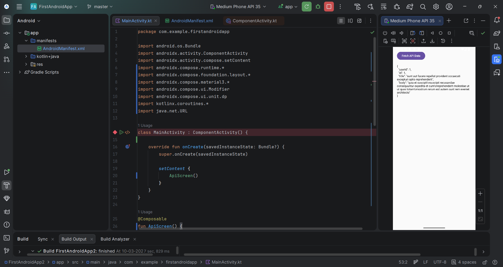

# Backend Integration and API Development

This project demonstrates backend API integration in an Android application.

## Features
- Fetch data from REST API
- Display API response in Android UI
- Handle network requests using Kotlin

## API Used
https://jsonplaceholder.typicode.com/posts/1

## Screenshot

## Tools Used
Android Studio  
Kotlin  
Jetpack Compose  
REST API
